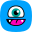

# Podcast Badges

> A collection of vector podcast app icons

## Table of Contents
1. [About The Project](#about-the-project)
1. [Badges](#badges)
1. [Contributing](#contributing)
1. [License](#license)

## About The Project
When designing Podlink, I hunted down vector versions of all the podcast app icons, redrawing them in some cases, and tweaked them to fit my aesthtic, namely masking them within a [superellipse](https://en.wikipedia.org/wiki/Superellipse). Since then, I’ve watched people appropriate my distinctive versions of the icons for their own purposes. Given that we’re talking about other companies’ trademarks, I have no standing to call them a thief.

## Badges

| App | Icon | Light Badge | Dark Badge |
| --- | ---- | ----------- | ---------- |
| Amazon Music |  |  |  |
| Antennapod |  |  |  |
| Anytime Player |  |  |  |
| Apple Podcasts |  |  |  |
| Audacy |  |  |  |
| Breaker |  |  |  |
| Bullhorn |  |  |  |
| Castamatic |  |  |  |
| Castbox |  |  |  |
| Castro |  |  |  |
| CurioCaster |  |  |  |
| Deezer |  |  |  |
| Downcast |  |  |  |
| Fathom |  |  |  |
| Fountain |  |  |  |
| Global Player |  |  |  |
| Goodpods |  |  |  |
| Google Podcasts |  |  |  |
| iHeartRadio |  |  |  |
| iVoox |  |  |  |
| Listen Notes |  |  |  |
| Luminary |  |  |  |
| Moon FM |  |  |  |
| Overcast |  |  |  |
| Pandora |  |  |  |
| Player FM |  |  |  |
| Pocket Casts |  |  |  |
| Podbean |  |  |  |
| Podcast Addict |  |  |  |
| Podcast Guru |  |  |  |
| Podcast Index |  |  |  |
| Podcast Republic |  |  |  |
| Podchaser |  |  |  |
| Podfriend |  |  |  |
| Podhero |  |  |  |
| Podimo |  |  |  |
| Podknife |  |  |  |
| Podnews |  |  |  |
| podStation |  |  |  |
| Podverse |  |  |  |
| Podvine |  |  |  |
| RadioPublic |  |  |  |
| RSS |  |  |  |
| Samsung Free |  |  |  |
| Snipd |  |  |  |
| Sonnet |  |  |  |
| Spotify |  |  |  |
| Stitcher |  |  |  |
| The Podcast App |  |  |  |
| TuneIn |  |  |  |

## Contributing

If you’d like to submit new or improved icons, please fork the repo and create a pull request.

1. Fork the Project
2. Create your Branch (`git checkout -b newicon/App-Name`)
3. Commit your Changes (`git commit -m 'Adding icon for App-Name'`)
4. Push to the Branch (`git push origin newicon/App-Name`)
5. Open a Pull Request

## License

Distributed under the MIT License. See `LICENSE.md` for more information.
